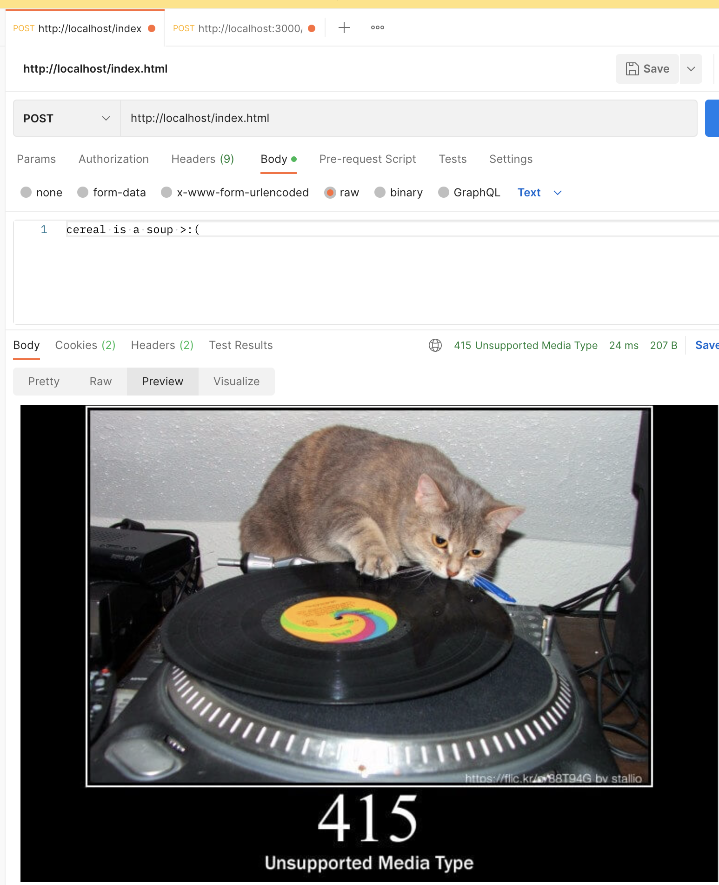

<h1>HTTP Server</h1>

Please check the individual markdown files or refer to the dropdowns below...

                
How to Run...

                    <!-- Space -->

`javac ./*.java ./threads/*.java ; java SocketServer.java` on the root level of `/HTTPServer`

                
GET

                    <!-- Space -->

# Supported MIME Types

Technically, this server has no restrictions on what MIME types are restricted. 

    contentType = Files.probeContentType(file.toPath());    // automatically convert filename to `Content-Type` form

Here are some examples of what can be fetched with GET.

---

## URL: `http://localhost/example.txt`
>`text/plain`

Notice how the text file contents is fetched and displayed on the browser.

---

## URL: `http://localhost/index.html`
>`text/html` 
>
>`image/jpeg`
>
>`image/gif`

Calling the [index HTML page](public/index.html) using `http://localhost/index.html` and then the HTML page itself is calling the [PNG image](public/satoru_gojo.jpg) and the [GIF image](public/jujutsu-kaisen-funny.gif) inside the HTML.

    

        <!-- HTML Q4 -->
        
        

        
    

>The `./satoru_gojo.jpg` and `jujutsu-kaisen-funny.gif` are relative paths that is in the `/public` folder and on the same level as the `index.html`.

---

## (ERROR) URL: `http://localhost/example.tx`

Notice how there is no file with the name `example.tx` within the `/public` folder. Therefore, the server returns an error code of `404 NOT FOUND` along with the corresponding HTTPCat.

                
POST

                    <!-- Space -->

# Supported MIME Types

As the spec mentions, this only supports `text/plain`.

## URL: `http://localhost/example.txt`

Before the POST request - `public/example.txt`

    cereal is definitely not a soup

After the POST request - `public/example.txt`

## (ERROR - 415) URL: `http://localhost/index.html`

## (ERROR - 404) URL: `http://localhost/index.h`

                
PUT

                    <!-- Space -->

## URL: `http://localhost/example.txt`

Before the PUT request (after the POST request from before)- `public/example.txt`

    cereal is definitely not a soup cereal is a soup >:(

After the PUT request on existing file - `public/example.txt`

After the PUT request on new file - `public/hot_dog.txt`

## Handles `404` for `FILE NOT FOUND` and `500` error for `INTERNAL SERVER ERROR`.

                
DELETE

                    <!-- Space -->

## URL: `http://localhost/hot_dog.txt`

Before the DELETE request - we made the `hot_dog.txt` file under `/public` from the `PUT` request section. **Now we are going to delete it**

## Handles `404` for `FILE NOT FOUND`.

Let's try delete `hot_dog.txt` again after deleting it with the process above.

